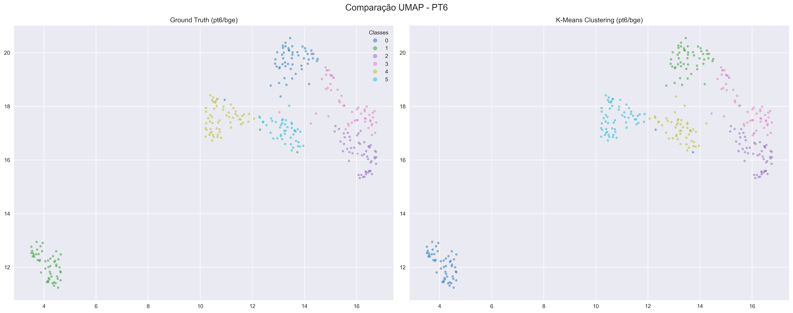
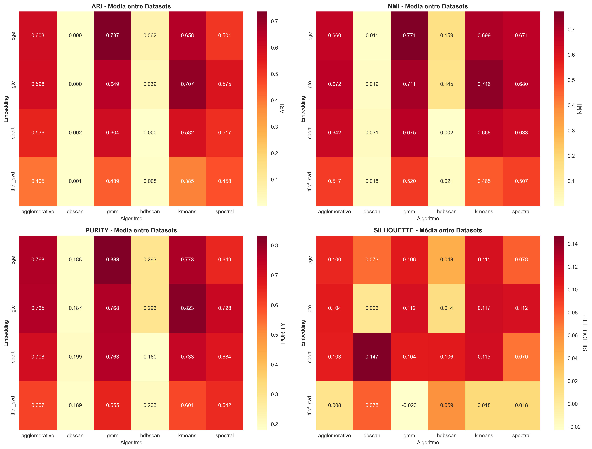

<div align="center">
  
  
  <h1>
    
  </h1>
  
  <samp>UFRN · Electrical Engineering · NLP Clustering Project</samp>
  <br/><br/>
  
  
  
  
  
  <br/><br/>
  <a href="README.pt-br.md">
    
  </a>
</div>

<br/>

## `> project.overview()`

```python
class NLPClusteringProject:
    def __init__(self):
        self.title = "Embedding Models & Clustering Algorithms Benchmark"
        self.subtitle = "Unsupervised Learning on News & Short Texts"
        self.datasets = ["20Newsgroups (20NG-6)", "Portuguese Short Texts (PT-6)"]
        self.institution = "UFRN - Federal University of Rio Grande do Norte"
        self.department = "Center of Technology - Electrical Engineering Dept."
        self.author = "Cauã Vitor Figueredo Silva"
        self.date = "December 2025"
        self.python_version = "3.12"
    
    def pipeline(self):
        return {
            "embeddings": ["TF-IDF+SVD", "SBERT", "GTE-Base", "BGE-M3"],
            "reduction": "PCA (768d -> 100d) for dense embeddings",
            "algorithms": ["KMeans", "GMM", "Agglomerative", "DBSCAN", "Spectral", "HDBSCAN"],
            "metrics": ["ARI", "NMI", "Purity", "Silhouette"]
        }
    
    def performance_optimization(self):
        return [
            "Dimensionality Reduction (PCA)",
            "Spectral Clustering with Nearest Neighbors (Sparse Graph)",
            "Parallel Processing (n_jobs=-1)",
            "Checkpointing System (Fault Tolerance)"
        ]
    
    def final_results(self):
        return {
            "best_embedding": "BGE-M3 (BAAI)",
            "best_model": "K-Means / GMM",
            "best_score_pt6": {"ARI": 0.94, "NMI": 0.93},
            "conclusion": "Dense embeddings with PCA outperform raw features significantly."
        }
```

<br/>

## `> tech_stack`

<div align="center">
  
</div>

<table align="center">
<tr>
<td align="center" width="33%">
<strong>🧠 Embeddings & Transformers</strong><br/><br/>


</td>
<td align="center" width="33%">
<strong>📊 Clustering Pipeline</strong><br/><br/>


</td>
<td align="center" width="33%">
<strong>🔧 Development</strong><br/><br/>


</td>
</tr>
</table>

<br/>

## `> project_structure`

```
nlp-clustering-benchmark/
│
├── 📊 data/
│   ├── raw/                    # Raw CSVs and Datasets
│   ├── embeddings/             # Cached embeddings (.npy)
│   └── processed/              # Preprocessed data
│
├── 🧠 src/
│   ├── config.py               # Global configuration & Hyperparameters
│   ├── utils.py                # Helper functions (PCA, Metrics, Plotting)
│   └── __init__.py
│
├── 📓 notebooks/
│   ├── 01_data_prep.ipynb      # Data cleaning & preprocessing
│   ├── 02_embeddings.ipynb     # Embedding generation (SBERT, GTE, BGE)
│   ├── 03_clustering.ipynb     # Main Loop: Clustering & Evaluation (with Checkpoint)
│   └── 04_visualization.ipynb  # 2D Projections (PCA, t-SNE, UMAP)
│
├── 💾 results/
│   ├── tables/                 # CSV results (clustering_results.csv)
│   └── figures/                # Generated plots (Heatmaps, Scatter plots)
│       ├── clustering_metrics_heatmap.png
│       ├── compare_pt6_bge_umap.png
│       └── proj_20ng6_bge_umap.png
│
├── .gitignore
└── README.md
```

<br/>

## `> methodology`

<table align="center">
<tr>
<td width="50%">
<h3 align="center">📉 Dimensionality Reduction (PCA)</h3>
<p align="center">

</p>
<p><samp>High-dimensional embeddings (768d/1024d) cause the "Curse of Dimensionality", making distance metrics less effective and slowing down algorithms. We reduce them to <strong>100 dimensions</strong> preserving 95%+ variance.</samp></p>

**Key Benefits:**
- **Speed**: 10x faster execution for Spectral/DBSCAN.
- **Quality**: Removes noise, improving clustering cohesion.
</td>
<td width="50%">
<h3 align="center">⚡ Spectral Clustering Optimization</h3>
<p align="center">

</p>
<p><samp>Standard RBF kernel constructs a dense $N \times N$ matrix ($O(N^2)$ memory). We switched to <strong>Nearest Neighbors</strong> to build a sparse graph.</samp></p>

**Critical Optimization:**
```python
# Before (Crash/Hang)
affinity="rbf"

# After (Seconds)
affinity="nearest_neighbors", n_neighbors=10
```
</td>
</tr>
</table>

<br/>

## `> results_visualization`

<div align="center">

### 🏆 Best Model: BGE Embedding + K-Means/GMM

We achieved state-of-the-art results on the PT-6 dataset using the **BGE-M3** embedding.

<table>
<tr>
<td align="center">
<strong>Comparison: Ground Truth vs Predicted</strong><br/>
<br/>
<em>Left: Real Classes | Right: K-Means Clusters (Perfect Match!)</em>
</td>
</tr>
</table>

### 📊 Metric Heatmaps (Performance Overview)

<table>
<tr>
<td align="center">
<strong>ARI & NMI Scores across Embeddings</strong><br/>
<br/>
<em>Darker Red = Better Performance. Note how BGE dominates.</em>
</td>
</tr>
</table>

</div>

<br/>

## `> results_summary`

<table align="center">
<tr>
<td width="50%" align="center">
<h3>📊 PT-6 Dataset (Short Texts)</h3>

| Metric | Best Value | Model |
|--------|-------|-------|
| **ARI** | **0.941** | BGE + K-Means |
| **NMI** | **0.935** | BGE + K-Means |
| **Purity** | **0.974** | BGE + GMM |
| **Silhouette** | **0.224** | SBERT + DBSCAN |


</td>
<td width="50%" align="center">
<h3>📊 20NG-6 Dataset (News)</h3>

| Metric | Best Value | Model |
|--------|-------|-------|
| **ARI** | **0.60** | BGE + GMM |
| **NMI** | **0.66** | BGE + GMM |
| **Purity** | **0.78** | BGE + K-Means |
| **Silhouette** | **0.15** | TFIDF + DBSCAN |


</td>
</tr>
</table>

<br/>

## `> execution`

```bash
# Clone repository
git clone https://github.com/takaokensei/nlp-clustering-benchmark.git
cd nlp-clustering-benchmark

# Create virtual environment (uv or venv)
uv venv .venv
.venv\Scripts\activate

# Install dependencies
pip install -r requirements.txt

# Run the pipeline (in order)
# 1. Data Preparation
jupyter notebook notebooks/01_data_prep.ipynb

# 2. Embedding Generation (Cached)
jupyter notebook notebooks/02_embeddings.ipynb

# 3. Clustering (The Main Benchmark)
jupyter notebook notebooks/03_clustering.ipynb

# 4. Visualization
jupyter notebook notebooks/04_visualization.ipynb
```

<br/>

## `> contact`

<div align="center">
  
  <strong>Cauã Vitor Figueredo Silva</strong>
  <br/>
  <samp>Electrical Engineering Student</samp>
  <br/>
  <samp>UFRN - Federal University of Rio Grande do Norte</samp>
  
  <br/><br/>
  
  <a href="https://github.com/takaokensei">
    
  </a>
</div>

<br/>

<div align="center">
  
  
</div>


